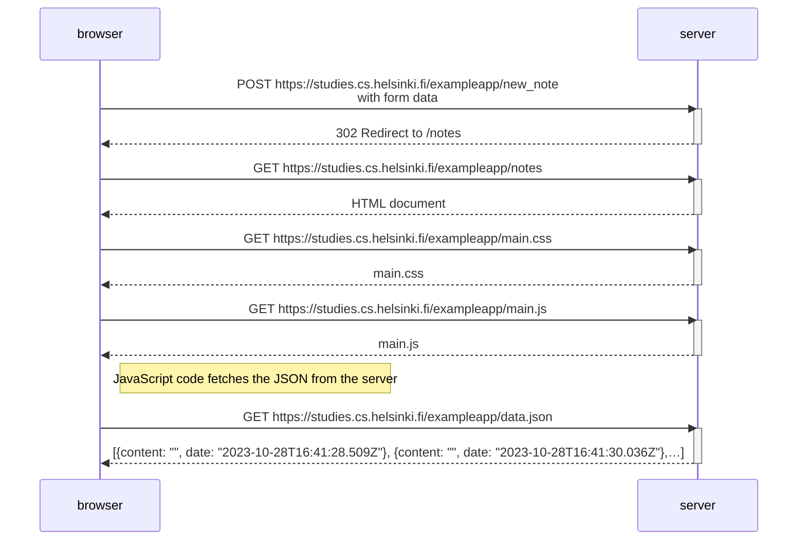

```mermaid
sequenceDiagram
    participant b as browser
    participant s as server

    b->>s: POST https://studies.cs.helsinki.fi/exampleapp/new_note <br /> with form data
    activate s
	s-->>b: 302 Redirect to /notes
	deactivate s
	b->>s: GET https://studies.cs.helsinki.fi/exampleapp/notes
    activate s
    s-->>b: HTML document
    deactivate s

    b->>s: GET https://studies.cs.helsinki.fi/exampleapp/main.css
    activate s
    s-->>b: main.css
    deactivate s

    b->>s: GET https://studies.cs.helsinki.fi/exampleapp/main.js
    activate s
    s-->>b: main.js
    deactivate s

    Note right of b: JavaScript code fetches the JSON from the server

    b->>s: GET https://studies.cs.helsinki.fi/exampleapp/data.json
    activate s
    s-->>b: [{content: "", date: "2023-10-28T16:41:28.509Z"}, {content: "", date: "2023-10-28T16:41:30.036Z"},…]
    deactivate s
```
