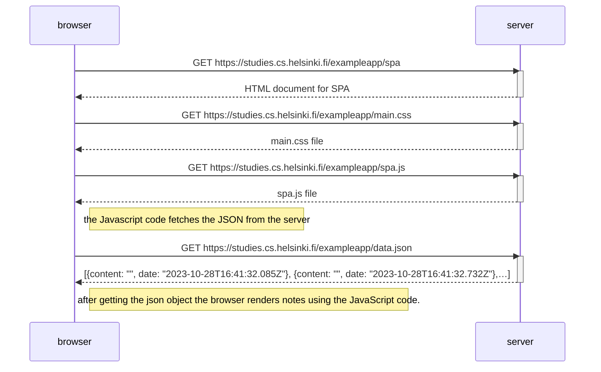

```mermaid
sequenceDiagram
	participant b as browser
	participant s as server
	b->>s: GET https://studies.cs.helsinki.fi/exampleapp/spa
	activate s
	s-->>b: HTML document for SPA
	deactivate s
	b->>s: GET https://studies.cs.helsinki.fi/exampleapp/main.css
	activate s
	s-->>b: main.css file
	deactivate s
	b->>s: GET https://studies.cs.helsinki.fi/exampleapp/spa.js
	activate s
	s-->>b: spa.js file
	deactivate s
	Note right of b: the Javascript code fetches the JSON from the server	
	b->>s: GET https://studies.cs.helsinki.fi/exampleapp/data.json
	activate s
	s-->>b: [{content: "", date: "2023-10-28T16:41:32.085Z"}, {content: "", date: "2023-10-28T16:41:32.732Z"},…] 
	deactivate s
	Note right of b: after getting the json object the browser renders notes using the JavaScript code. 
```
