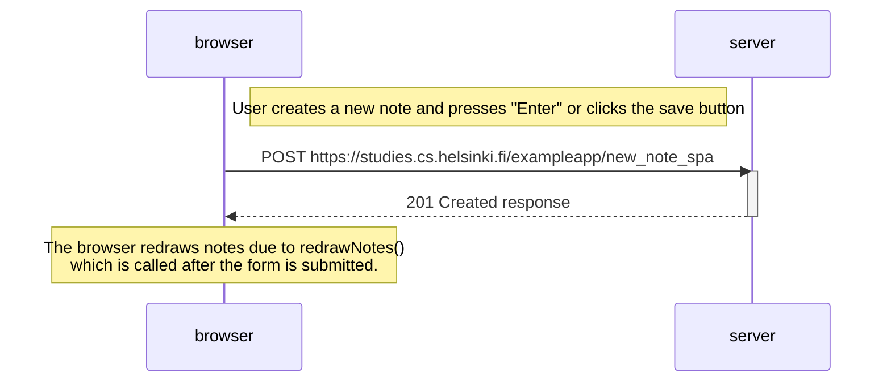

```mermaid
sequenceDiagram
	participant b as browser
	participant s as server

	Note right of b: User creates a new note and presses "Enter" or clicks the save button
	b->>s: POST https://studies.cs.helsinki.fi/exampleapp/new_note_spa
	activate s
	s-->>b: 201 Created response
	deactivate s
	Note over b: The browser redraws notes due to redrawNotes() <br />which is called after the form is submitted.
 
```
